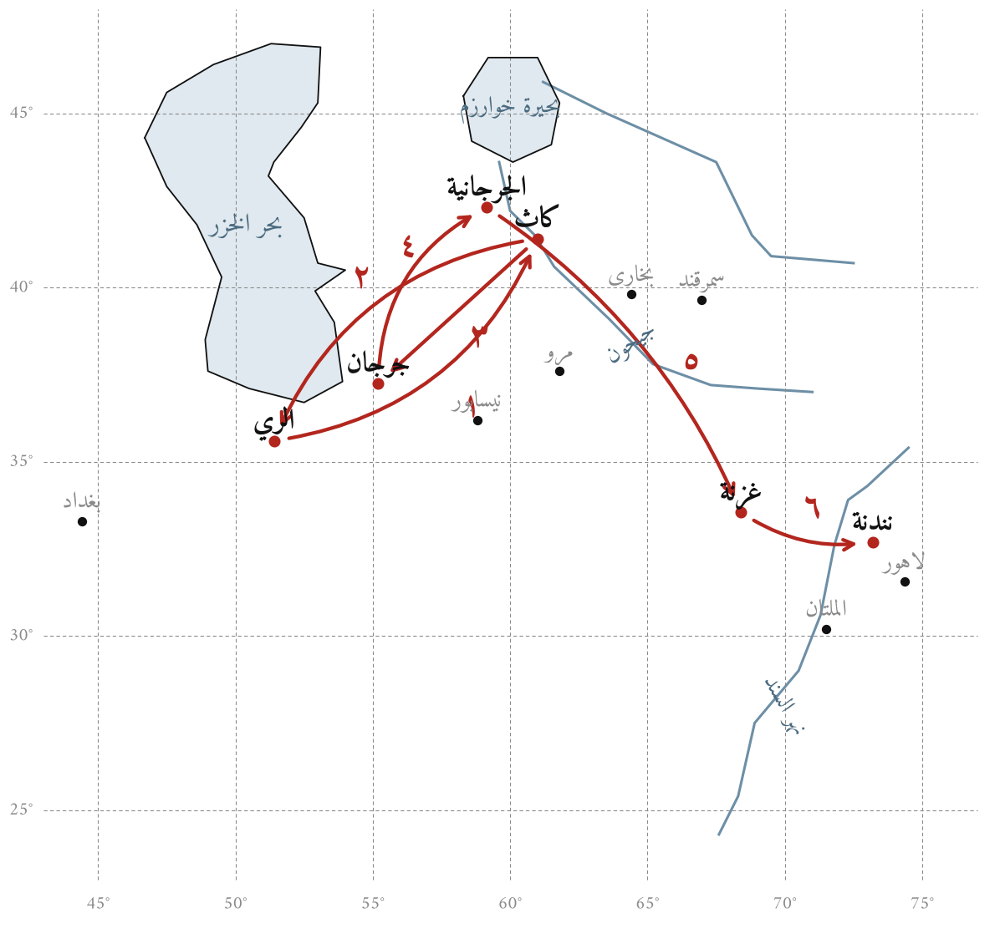

# الباب الأول: البيروني، حياته ورحلته العلمية

## نسبه ومولده

هو أبو الريحان محمد بن أحمد البيروني الخوارزمي. وُلد في ذي الحجة سنة ٣٦٢ هـ (أيلول/سبتمبر ٩٧٣ م) في ضاحية مدينة كاث، حاضرة خوارزم القديمة على الضفة الشرقية لنهر جيحون (آمو داريا). وإلى «البيرون»، أي ظاهر المدينة، يُنسب في أشهر الأقوال. نشأ في كنف أسرة بني عراق، ملوك خوارزم المعروفين بخوارزمشاهية آل عراق. وتلقّى الرياضيات والفلك على أبي نصر منصور بن علي بن عراق، أحد أعلام علم المثلثات الكروية،^[Kennedy 1970؛ Saliba 1990.] وهو الذي ينقل عنه البيروني في هذا الكتاب طريقته في تخطيط القطع الزائد (الشكلان ٦٣ و٦٤).

## الرحلة الأولى: من كاث إلى الري

في سنة ٣٨٥ هـ (٩٩٥ م) استولى المأمون بن محمد صاحب الجرجانية على كاث، وانتهى ملك آل عراق. فاضطر البيروني الشاب إلى مغادرة بلده، ونزل الري. وهناك لقي أبا محمود حامد بن الخضر الخجندي صاحب «السدس الفخري» الذي رصد به الميل الكلي سنة ٣٨٤ هـ.^[البيروني، *تحديد*؛ Ali 1967، في الكلام على رصد الخجندي للميل الكلي.] وتظهر آثار هذه الصلة في الكتاب، إذ يورد البيروني طريقة الخجندي في عمل دوائر السموت (الشكل ١٤).

## العودة إلى خوارزم ورصد الكسوف

عاد البيروني إلى خوارزم. وفي سنة ٣٨٧ هـ (٩٩٧ م) رصد بكاث خسوفًا للقمر، اتفق مع أبي الوفاء البوزجاني على رصده في الوقت نفسه ببغداد، ليستخرجا من فرق الوقتين فرق الطول بين البلدين. وهذا من أقدم الأمثلة على الأرصاد المتزامنة لتعيين الأطوال الجغرافية.^[البيروني، *تحديد*، في تعيين فرق الطول بين بغداد وخوارزم؛ Kennedy 1970.]

## في جرجان عند شمس المعالي قابوس

ثم قصد جرجان، ونزل في رعاية الأمير شمس المعالي قابوس بن وشمكير الزياري. وله صنّف نحو سنة ٣٩٠ هـ (١٠٠٠ م) كتابه «الآثار الباقية عن القرون الخالية» في التقاويم والأعياد وتواريخ الأمم.^[البيروني، *الآثار*؛ Sachau 1879.] وهي مرحلة نضج فيها اهتمامه بالآلات الفلكية والتسطيح، وراسل فيها أعلام عصره. وفي هذه المرحلة كان يتردد في كتب الصناعة ذكر أبي سعيد السجزي وأبي حامد الصاغاني وأبي سهل الكوهي، وهم أصحاب أكثر ما يرويه في «الاستيعاب» من الوجوه الغريبة.

## في الجرجانية عند المأمونيين

عاد بعد ذلك إلى خوارزم، فالتحق ببلاط الأمير أبي الحسن علي بن مأمون، ثم بأخيه أبي العباس مأمون بن مأمون، في الجرجانية (كركانج) عاصمة خوارزم الجديدة. فعلت منزلته حتى صار من خاصة الأمير ومستشاريه. ووافق ذلك وجود ابن سينا وأبي سهل المسيحي في المدينة، فيما عُرف بـ«مجلس المأمون».^[Kennedy 1970.]

## إلى غزنة والهند

في سنة ٤٠٨ هـ (١٠١٧ م) استولى السلطان محمود بن سبكتكين الغزنوي على خوارزم، وحمل معه البيروني إلى غزنة. وقضى البيروني بقية عمره في الدولة الغزنوية. وصحب حملات السلطان إلى بلاد الهند، فتعلم السنسكريتية وقرأ كتب الهنود في الحساب والنجوم. ومن هذه المرحلة:

- قياس نصف قطر الأرض عند قلعة نندنة في سفح جبال الملح (البنجاب)، بطريقة انحطاط الأفق من رأس جبل معلوم الارتفاع.^[البيروني، *تحديد*؛ Ali 1967؛ البيروني، *القانون*، المقالة الخامسة.]
- كتاب «تحديد نهايات الأماكن لتصحيح مسافات المساكن»، فرغ منه سنة ٤١٦ هـ (١٠٢٥ م).
- كتاب «تحقيق ما للهند من مقولة مقبولة في العقل أو مرذولة»، نحو سنة ٤٢١ هـ (١٠٣٠ م).^[البيروني، *الهند*؛ Sachau 1888.]
- «القانون المسعودي» في الهيئة والنجوم، أهداه إلى السلطان مسعود بن محمود.^[البيروني، *القانون*.]
- كتاب «الجماهر في معرفة الجواهر»، و«الصيدنة في الطب»، في آخر عمره.

وتوفي بغزنة بعد سنة ٤٤٠ هـ (١٠٤٨ م)، وقد جاوز الخامسة والسبعين.^[Kennedy 1970؛ Saliba 1990. والتواريخ في هذا الباب تقريبية في أكثرها، ويرجع في تفصيلها إلى هذين المرجعين.]

## خريطة الرحلة

{width=95%}

## جدول زمني

| السنة الهجرية | السنة الميلادية | الحدث |
|:------|:------|:------------------------------|
| ٣٦٢ | ٩٧٣ | مولده بظاهر كاث في خوارزم |
| ٣٨٥ | ٩٩٥ | سقوط آل عراق وخروجه إلى الري ولقاؤه الخجندي |
| ٣٨٧ | ٩٩٧ | رصد خسوف القمر بكاث متزامنًا مع أبي الوفاء ببغداد |
| نحو ٣٩٠ | نحو ١٠٠٠ | في جرجان: «الآثار الباقية» لقابوس بن وشمكير |
| نحو ٣٩٩–٤٠٧ | نحو ١٠٠٩–١٠١٧ | في الجرجانية في بلاط المأمونيين |
| ٤٠٨ | ١٠١٧ | فتح محمود الغزنوي لخوارزم وانتقاله إلى غزنة |
| ٤١٦ | ١٠٢٥ | الفراغ من «تحديد نهايات الأماكن» |
| نحو ٤٢١ | نحو ١٠٣٠ | «تحقيق ما للهند» |
| ٤٢٧ | ١٠٣٦ | كتب فهرس مؤلفاته، وفيه ذكر «الاستيعاب» |
| بعد ٤٤٠ | بعد ١٠٤٨ | وفاته بغزنة |

## البيروني والآلات

لم يكن البيروني منظّرًا فحسب. فقد كان راصدًا وصانعًا، يعرف دقائق الصنعة من خرط الحلقة وتجويف الأم وتخريم العنكبوت وتسوية العضادة. ويظهر ذلك في «الاستيعاب» في عنايته بالتفاصيل العملية. فهو يذكر «دستور الدوائر» و«دستور الأقطار» اللذين يُستعان بهما على القسمة (الشكلان ١–٣)، وكيف يُحفر الفرس على هيئة رأس الفرس (الشكل ١٨)، وكيف تُسنّ أسنان حُقّ القمر وتُلحم البكرات بعضها ببعض (الشكلان ٧٩ و٨٠). ويجمع إلى ذلك نظرًا رياضيًا دقيقًا يرتفع إلى نظرية القطوع المخروطية عند أبلونيوس (الشكلان ٥٨–٦٤) وإلى البركار التام لأبي سهل الكوهي (الأشكال ٦٥–٧٠).
